```{r setup, include=FALSE}
knitr::opts_chunk$set(echo = TRUE, fig.height = 4)
```
# Team Information
**Team Members:** M.K. Finnegan$^1$, K. Anapindi; DH Hwang; R Dalmia

&nbsp;&nbsp;&nbsp;&nbsp; 1. *Corresponding Author*

# Note to the Reader
*The code that generated these results can be found at [this github repository](https://github.com/heuristicwondering/STAT432-StatisticalLearning-FinalProject). Data is too large to submit with project. The data is available upon request to the corresponding author at mkfinne2@illinios.edu*

# Abstract
Mind wandering (a type of task unconstrained thought) is an important phenomenon that is presumed to occur during resting state imaging paradigms. Little is known about the temporal dynamics of these thoughts during the resting state, however the dynamics of brain connectivity which presumably represent such thoughts are beginning to be explored with dynamic connectivity in fMRI. Current techniques for classifying similarities of brain connectivity in this approach have not been evaluated for the meaningfulness of their classifications. This proposed study uses inferred cognitive states as the "true classification" of a given brain state allowing for testing of classification accuracy. Under the principled presumption that classification accuracy during task paradigms can provide an estimate of accuracy during rest paradigms we use two emotional processing tasks to evaluate these methods. Cognitive states are inferred by the stimuli being presented during two different block design tasks and metrics of psychopathology such as depression and anxiety. Modern clustering algorithms are tested as to whether they provide clusters that accurately overlap stimuli presentation during two block design tasks subject to potential covariance with measures of psychopathology symptoms.

<!-- ------------------------------------------------------------------------------------------------------------- -->
<!-- ------------------------------------------------------------------------------------------------------------- -->
<!-- ------------------------------------------------------------------------------------------------------------- -->

# Introduction
There is a wealth of evidence that when humans aren't engaged in any externally oriented task, they are consistently immersed in a phenomenon called mind-wandering (@binder1999conceptual,@buckner2008brain,@christoff2016mind,@mason2007wandering,@smallwood2015science). This is a type of unconstrained thought that may facilitate creativity and problem solving (@fox2015wandering), but in more maladaptive forms, may be repsonsible for the recurrence and maintenance of both depressive and anxious disorders (@teasdale1983negative,@burdwood2016resting,@nolen1991responses,@nolen2000role).

*Dynamic connectivity* is comparitively recent development in functional neuroimaging analysis that shows immense promise towards understanding the role of mind-wandering in health and disease (@kucyi2014dynamic). For the interested reader, please refer to the original study proposal for a more comrehensive overview of the concepts involved in dynamic connectivity. Briefly, by calculating brain connectivity (*a.k.a* correlations of hemodynamic fluctuations across brain regions) on short time windows (on the order of seconds to minutes) rather than across an entire scan (which is typically on the order of 10 to 20 minutes), we can capture the temporal fluctuations of brain activity across a scan (@hutchison2013dynamic). These fluctations presumably reflect, in part, the fluctuations of the internal contents of thought.

A current common practice to label similar connectivity matrices produced by this approach is k-means clustering using either the L1 (Manhattan distance) or L2 (Euclidean distance) norms (@hutchison2013dynamic,@allen2014tracking). Typically, the k-means derived clusters are assumed to represent either unitary cognitive states or transitions between two unitary states. The differences of members across cluster are then either qualitatively or quantiatively analyzed (such as noting the degree of connectivity between executive and emotional systems) to make inferences about the nature of thought across time. In fact, this approach has been used to argue that short term meditation trainining decreases the mind's propensity to wander (@mooneyham2017states) and that people who are more likely to  be creative posess unique types mindwandering (@beaty2018brain).

K-means clustering however, will always produce clusters regardless of how well those clusters represent the underlying distribution of the data. Under certain distributions, k-means clusters have little if any relation to the regularities inherent in the data. The algorithm underlying k-means seeks to minimize the within-cluster distance objective function. For the case of the commonly used Euclidean distance:

\[
\sum_{i=0}^{n} \min_{\mu_j \in C}(\parallel x_i - \mu_j \parallel^2)
\]

This makes the implicit assumption that the true clusters are both convex and isotropic (*i.e.* their boundaries can be defined by circles drawn around them). This means the k-means will not perform well when the data is non-convex, has anisotropic covariance, has spatially overlapping memberships, or contains outliers which artificially skew cluster means. There is no known evidence that that brain connectivity as represented in ${\rm I\!R}^n$ meets any of these assumptions.

The purpose of this study is to examine the suitability of k-means in real data. In order to test the accuracy of the clustering results, two task-based paradigms are used in which the "true" classification of a brain state is assumed to be the stimuli presented at that time. See Appendix A (material originally introduced in the project proposal but for convenience to the reader, included here) for a detailed exposition of the philosophical assumptions justifying this approach. This allows us to test the derived classification against the "true" labels. Two tasks within the same subject cohort are employed as a means to assess the robustness of k-means clustering across paradigms while controling for subject demographics. Each task was repeated across two scans within each subject (for a total of 4 scans per subject), which is leveraged to ensure algorithms are not fitting technological sources of variance such as magnetic gradient nonlinearities or subject head position induced distortions (@jovicich2006reliability) which may vary across scans. As an extension of this work, alternate classification approaches are explored for potential improvements to current dynamic connectivity analisys practice.

Distribution of the raw data imaging data is restricted due to HIPPAA considerations, thus is not included in this report however all derived data, including timecourses used to produce the correlation matrices can be found in the link to the team's Box account submitted with this report.

## Description of Data Set
### Participants
The results reported here are based on a subset of women from a larger study examining the role of stress physiology in mother-infant interactions. They were primarily recruited from community agencies serving low-income women in a mid-size city of the Pacific Northwest. Twenty-five mothers with 3-month old infants agreed to participate in the additional neuroimaging reported here. Mean age for these mothers was $\mu = 26.4$ ($SD = 3.8$). Most identified as Caucasian (72\%), with 12\% reporting Latina ancestory, 8\% Asian American, and 8\% other. Eightyfour percent reported some education beyond high school, with 24\% having completed a college degree. No infants had serious health complications and the majority were born on time (4\% before 37 weeks and 8\% after 41 weeks gestation). This dataset is also described in @laurent2018mindfulness. Ethical approval for the study was obtained from University of Oregon Institutional Review Board and all mothers provided written informed consent.

### Scan Paradigm
Participant engaged in two separate tasks for this study, one involving infants expressing emotions and the other presenting emotionally expressive faces, however only the task observing infant emotional cues is reported here. The task was repeated across two scans. Scans were counter balanced across tasks to control for order effects and subjects were allowed to shift positions between scans in order to minimize discomfort related head movements. See Figure 1 for an overview of both paradigms.

#### Infant Viewing Task
Mother's were instructed to "watch and respond as you would naturally" to videos of theirs or unknown others' infants expressing either positively or negatively valenced emotional cues. Emotional expressions in the infants were evoked during a video recording session occurring in a home setting. Positive valence expressions occurred during a peak-a-boo game played with the mother. Negative valence was induced by arm-restraint, a task known to evoke frustration response in infants (@moscardino2006infants). Each run lasted for approximately 7.5 minutes and consisted of alternating blocks of the infant emotion videos editted to be 15s in length.

#### Facial Viewing/Labelling Task
A second task involved a well studied paradigm of emotion regulation in which mothers viewed emotionally expressive faces from the NimStim database (@tottenham2002categorization). Face images were race matched to the participants to take advatage of heightened neural responsiveness to in-group faces (@chiao2008cultural). Three second instructions appeared prior to each stimulis block with the words "Look" or "Label", in which participants either were to passively view or label the emotional content of the faces. Blocks consisted of 5 faces of a given positive/negative valence (*e.g.* happy, sad, angry, etc.) each presented for 5 seconds each. Blocks were separated by 1-3s of jittered rest condition (alternately referred to as either "fixation" or "ISI", short for interstimulus interval). Each scan lasted for approximately 7.6 minutes.

```{r scanParadigm, echo=FALSE, fig.align="center", fig.cap="Schematic of the two tasks that produced the data. (A.) Mothers viewed either their own or others' infants displaying either positive (induced by playing peek-a-boo) or negative (induced by arm restraint) emotions. (B.) Mothers were instructed to either passively view or label the emotional content of humans faces."}
knitr::include_graphics("./images/scan-paradigm.jpg")
```
### Scan Acquisition
Scans were acquired at the University of Oregon using a Siemens Allegera 3 Tesla magnet. Whole brain images were taken with a 32-channel phase array birdcage coil. Shimming routines were conducted to optimize signal-to-noise with a subsequent fast localizer scan (FISP) and Siemens autoalign routine at the outset of every session. The two functional scans were then conducted followed by a high resolution anatomical scan.

#### Function Scans
All tasks used a T2*-weighted gradient echo sequence, with TR = 2000 ms, TE = 30 ms, flip angle = 90°, 32 contiguous slices acquired in ascending interleaved order, with thickness = 4 mm, 64 × 64 voxel matrix; 226-228 volumes per run.

#### Anatomical Scan
Anatomical images used a T1-weighted 3D MP-RAGE sequence, with TI = 1100 ms, TR = 2500 ms, TE = 3.41 ms, flip angle = 7°, 176 sagittal slices 1.0 mm thick, 256 × 176 matrix FOV = 256 mm.

<!-- ------------------------------------------------------------------------------------------------------------- -->
<!-- ------------------------------------------------------------------------------------------------------------- -->
<!-- ------------------------------------------------------------------------------------------------------------- -->

# Descriptive Exploration of Data
## Preprocessing
All preprocessing was carried out in the SPM12 software (@ashburner2014spm12) running under MATLAB 2018a on Windows 10 using a custom written batch interface. Because of the extensive time needed to run computations serially, all preprocessing routines were parallized across subjects. Preprocessing included slice-timing correction which is use to account for the fact that, due to the interleaved slice acquisition order, adjacent data points will represent activity up to 1 second apart in time. Data points are sync interpoloated either forward or backward in time to the reference slice, which was chosen to be the slice collected 1s into volume acquisition. Next, volumes within each scan underwent realingment and unwarping to correct for head motion artifacts across the scan.

Realignment consisted of a 2-pass procedure in which a mean image within a scan was calculated and volumes were put in alignment using a 6-parameter least squares approach to rigid body transformations. These estimated alignment parameters were then inspected to remove subjects with excessive head motion defined as more than 40\% of volumes containing greater than 2mm of estimated headmotion. This is a very liberal motion limit, however in clinical or hard-to-recruit samples, it is very common to relax more stringent limits and the particular value was taken on recommendation of the PI who supervised data collection. With this criteria, one subjected had to be discarded for excessive movement. Unwarping was also conducted to account for gradient field disortions that occur due to this movement. Although fieldmaps were acquired which provided an absolute measure of the degree of magnetic homogeneity throughout the field of view, they were not referenced during unwarping due to the fact that subjects moved substantially between scans making the field map not applicable to all runs. Instead deformations were estimate using SPM12 algorithms.

Functional images were then co-registered to the high resolution structural image for each subject. This involves similar computations to the realignment step, however alignment occurs across scans. The anatomical images were then used to calculate non-linear deformations to warp the brain into the Montreal Neurologic Institute (MNI) standard stereotaxic space in a process known as normalization. The detailed deformation fields were then applied to the low resolution functional images. This process allows for voxel-by-voxel comparisons across subjects and is necessary to apply the region-of-interest masks needed to extract data for k-means. Given that fMRI typically has a relatively poor signal-to-noise ratio, all functional images were smoothed with an 8mm FWHM Gaussian smoothing kernel in order to compensate for spurious fluctuations.

## Voxelwise Analysis
In order to confirm there was task correlated signal that could potentially drive clustering, a voxelwise level analysis was conducted to identify the location of point sources of signal before collapsing into region-of-interest analyses. SPM12 was also used for this phase of data exploration. After preproccessing, a general linear model was calculated for each subject at each voxel using a design matrix consisting of several components. First the onset of predictors, but because fMRI measures changes in the ratios of oxygenated and de-oxygenated hemoglobin, there is a temporal delay between stimuli presentation and observed response. To account for this, these predictors were convolved with what is known as the *hemodynamic response function* which estimates this delayed response for an intantaneous stimuli. Next, the estimated motion realignment parameters to remove any remaining variance associated with head motion. Then a 6 predictor cosine basis set provided by the SPM12 software and used to account for scanner drift, in which the magnetic fields slowly occilate over time (which creates low-frequency occilations in the voxel intensity values), this essentially acts as a high-pass temporal filter set *a priori* at 128Hz.

Due to the relatively high amounts of motion discovered in this data, additional regressors were added to deweight an volumes exceeding 2mm of realignment. Data was pooled across scan types to reduces the number of individual models to estimate and dummy variables accounting for run were also used. Because of the large amounts of regressors, the design matrix was explored for colinearity using vector cosines, although there was some degree of collinearity, no regressors were flagged by SPM12 integrity checks for levels of dependence that would impeded estimation. Models were estimated using an implicit mask to resrict analysis only to voxels likely to be brain (determined by mean intensity across volumes), and thus reduce the problem of multiple comparisons in hypothesis testing. Only the regression coefficients associated with stimuli were explored for signicant differences.

Contrasts were contructed for all pairwise contrast of regressors for every subject and t-values contructed using a fixed effects approach (the brain is the entire 'universe' of voxels). These statistics were used in a second group-level random effects analysis taken across subjects to explore signal across the entire dataset. Statistical correction for multiple comparisons was done in a heirarchical manner using the recommendations of (@eklund2016cluster) using a primary cluster-defining threshold of $p < .001$ uncorreted, and cluster selection with FWE-corrected cluster-level significance set at $p < .05$. The following table provides a summary of significant contrasts. The images that follow illustrate the extent of clusters discovered.

```{r significantContrasts, echo=FALSE, fig.align="center", fig.cap="Voxelwise contrasts showing significant results"}
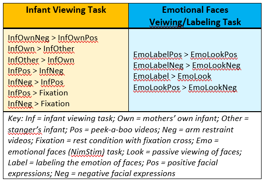
```

```{r connImages, echo=FALSE, out.width="400px", fig.align="center", fig.cap="Result images of selected voxelwise contrasts"}
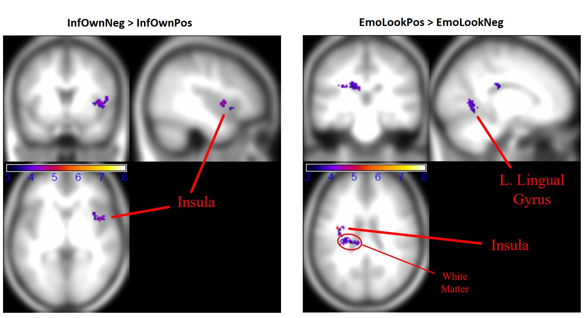
```

As can be seen in the table, both tasks provide significant differences in voxel intensity values across tasks. Withing the infant task, there were significant differences in both directions across the Own/Other and Pos/Neg distinction. Within a mother's own infant, there did appear to be a consistent directional effect of valence across all voxels and similarly between both valence conditions and fixation. Although both tasks contain task-meaningful signal, the infant task produced less extensive differences as is illustrated in smaller clusters evident in the infant contrast images shown.

## ROI analysis
Because the intended targets of clustering are not voxels themselves, but rather the correlations of anatomically defined voxel averages, we also explored how much of this task-dependent signal was preserved after voxel averaging. This is known as a region-of-interest (ROI) analysis. Regions of contiguous voxels were defined by referrence to the Automated Anatomically Labelled Atlas (@tzourio2002automated) and the MarsBar toolbox addition for SPM (@brett2002region). Mean intesity values were extracted for all defined regions, for all time points and for all subjects. All subsequent analyses reported here were conducted and visualized in `R`.

### Linear Regression
Linear regression was again used to assess for assessing the strength of the relationship between task and signal, however several using a simplified regression model. Stimuli regressors convolved with the hemodynamic response function were still used, however we estimate this with the `hrfConvolve` function in the `FAIR` package. The HRF is implemented as a a double gamma probability distribution parameters set for the commonly accepted model. A demonstration of this model on a finite impulse response shows the classic shape of the HRF that emerges.

```{r demonstateHRF, warning=FALSE, fig.width=4, fig.height=3,fig.align='center', message=FALSE}
# install.packages('FIAR') ## If needed
library('FIAR')
library(ggplot2)
fir = c(1,rep(0,14))
# Note that the data is assumed to be take every 1s. 
# This was not listed in the documentation.
hrf=hrfConvolve(fir) # some example data
exmpl = data.frame(time=seq(0,14),hrf=hrf)
ggplot(data=exmpl, aes(x=time,y=hrf))+
  geom_line()
```

Unfortunarely, R has not been extensively used for brain image analysis and there are very few resources for MRI-specific analysis. This is a poorly documented function and the package itself is still not fully tested, so results of this analysis should be seen as highly tentative. To simplify calculations, bulk head movement and volume deweighting was not included, but a 4 regressor cosine basis was included. All subjects were included in a single linear model with regressors of indicator variables for each (n=24) subject and the first or second run within subjects (s=2). 

```{r lmSummary, echo=FALSE, out.width="400px", fig.align="center", fig.cap="Summary of regression modelling in the Infant Task"}
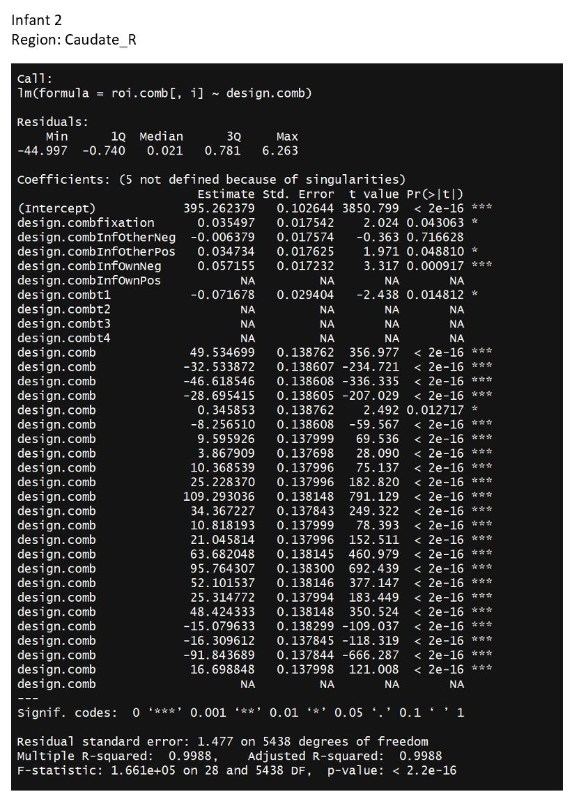
```
As can be seen in this representative linear model summary of the left caudate (Figure 4), several predictors and in particular fixation, InfOtherPos, and InfOwnNeg all significantly predicted ROI intensity values. This was consistent across most ROIs, although different combinations of predictors reached significance depending on the particular region. This left us with confidence that task correlated signal at the voxel level was indeed preserved through the smoothing process.

## Visual Comparison of ROI Intensities
Given the discrepant findings between the relevance of task at the voxel and the ROI level, we plotted the average intensity vs. the anatomical brain region of interest for visual inspection. This stacked area graph represents all the five different stimuli, with ISI being the baseline. The other 4 stimili (EmoLabelPos, EmoLabelNeg, EmoLookPos, EmoLookNeg) are stacked on top of it. From this graph, we can visualize whether the brain activity in a partcular region changes w.r.t. the stimuli or if the activity remains constant irrespective of the stimuli. From this graph, we did observe abrupt changes in the mean voxel intensity for certain regions (depicted by the step like pattern towards the top right) w.r.t to the control ISI intensity. This tells us that the voxell intensities do capture the brain changes in intensity w.r.t the stimuli and although this may not be apparent within individual ROIs, is still reasonable to expect to be represented in the correlation matrices that reflect between ROI coordination.

<!--- What code snippets to put here? --->

```{r stackedGraph, echo=FALSE, out.width="400px", fig.align="center", fig.cap="Stacked graph of ROI intensity across regions"}
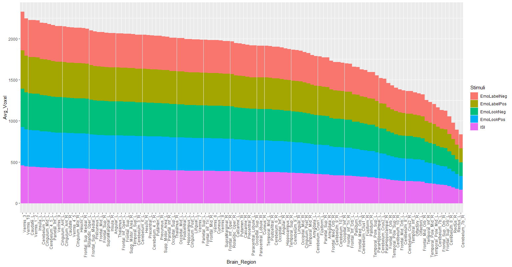
```


## Exploration of Laterality
This cohort was relatively high in depression symptoms with 9 out of 24 mothers meeting criteria for past or current depressive episodes or diagnosis. Depression is a very common postpartum complication (@pearlstein2009postpartum) with devasting consequences for both mother and infant (@lovejoy2000maternal,@stein2014effects,@gelaye2016epidemiology) and is 2nd leading cause of death (via suicide) for mothers in the first year of the infant's life (@wisner2013onset). It also has been known in neuroscience for a very long time that the brain exhibits a laterality in depression (@henriques1990regional) typified by persistent left frontal and right parietal hypoactivation (@demaree2005brain). To detect the presense of laterality between left-right homologous ROIs, we performed an paired, 2 -tail t-test for all the regions of a given stimulus between the left and right brain regions. Before performing the t-test, we tested for the distribution of the data (See Figure 6.) to ensure that all the necessary conditions to perform the hypothesis test are met.

```{r densityPlots, echo=FALSE, out.width="400px", fig.align="center", fig.cap="Density distributions of select ROIs"}
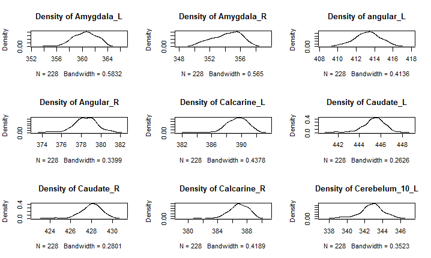
```
The results that we got from the t-test were quite interesting. After accounting for the multiple testing correction (Benjamini Hochberg), it turned out that almost every single region of interest actually had a significantly different (p<0.05) mean voxel intensity between the left and the right regions. It is unclear how much of this laterality difference may be driving the results presented below, but should be noted that this raises the ponential of implicit markers of psychopathology skewing results.

## Region Intensity Across Stimuli
A final aspect of the data that we wished to characterize was the inter-region variability vs. the inter-stimulus variability of the voxel intensity. A box-whisker plot (Figure 7) of representative regions was created to visually inspect this relationship. Regions from the boundaries of the field-of-view were excluded from these plots as they tend to have artificially low intensity values due to signal dropout near the edges of the shimming region. Based this plot, it is evident that the inter-region variability is much higher compared to the inter-stimulus variability. 

```{r boxPlots, echo=FALSE, out.width="400px", fig.align="center", fig.cap="Box-whisker plots of select ROIs across stimulus type"}
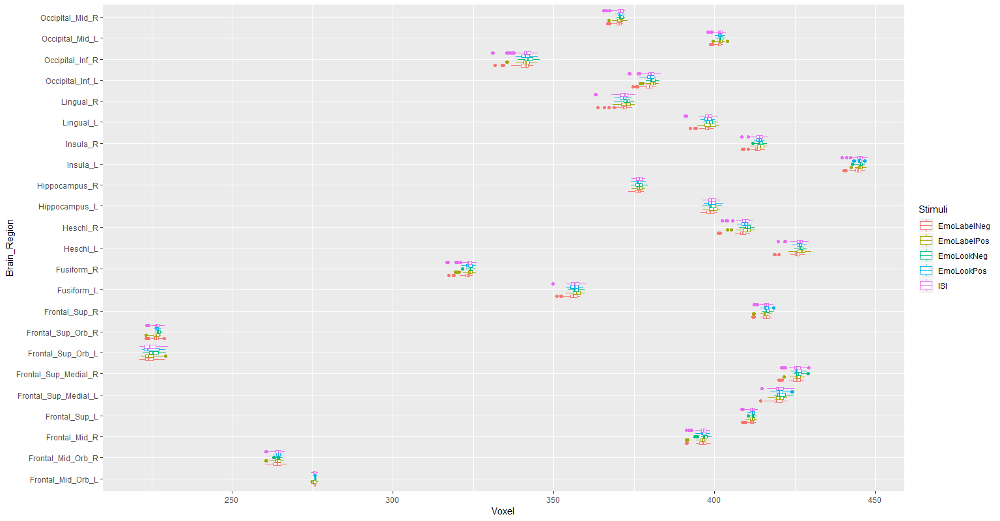
```

This result discouraged us from pursuing a clustering based on regional intensity values (as opposed to the correlations across regions), because there did not seem to be sufficient separation across tasks within any regions to warrent the computational expense. This is however, left as an avenue of future exploration.


# Planned Analysis
## Construction of Correlation Matrices
The impetus for this project is to assess the accuracy of k-means clustering when (under the philosophical assumptions in Appendix A) the "true" label of the brain states are known. To be reflective of the broader literature, brain states were conceptualized as connectivity and thus correlation matrices of ROI timecourses were constructed. The planned method was originally to use a sliding window approach to extract correlation matrices representative of the stimuli being presented, but it was later discovered that the timing of the stimuli did not provide wide enough windows for this approach to be feasible. A modified version was implemented in which stimuli labels were shifted forward in time to be representative of when they were contributing the most to the hemodynamic response. This was accomplished by creating indicator variables of the the time points in which stimuli were presented, $I(s,t) = 1, 0\:o.w.$. These were then convolved with the hemodynamic response function to produce the design matrices used in the exploratory linear regression. The code used to generate these shifts and matrices is outlined below.

```{r hrfShift, eval=FALSE, warning=FALSE}
ShiftVarNames <- function(stimuli){
  # Creates the design matrix, shifts everything by the HRF, then assigns new labels
  # Build design matrix
  design = data.frame(matrix(0, nrow = length(stimuli), ncol = length(levels(stimuli))))
  colnames(design) <- levels(stimuli)
  for(s in levels(stimuli)){
    design[which(stimuli == s),s] <- 1
  }
  
  # Due to an undocument feature of the hrfConvolve function, when raw data is passed, 
  # the assumed aqcuistion rate (TR) is 1 second. Since our data has TR =  2, expand 
  # design matrix to account for this.
  expandedDesign = rbind(design, design)
  n = nrow(design); r <- rep(1:n, each = 2) + (0:1) * n
  expandedDesign <- expandedDesign[r,]; rownames(expandedDesign) <- c(1:(n*2))
  # Shift value in each column by the HRF
  expandedDesign = apply(expandedDesign, MARGIN = 2, hrfConvolve)
  # Down sampling - taking the value at the first second of onset as the instantaneous 
  # value due to slice timing correction to the time point in preprocessing.
  design <- expandedDesign[seq(1,nrow(expandedDesign),2),]
  
  # Reassigning stimuli labels according to what has the max value
  maxStimIndx = apply(design, MARGIN = 1, which.max)
  newStim = levels(stimuli)[maxStimIndx]
  # Although convolution may assign higher values to other stimuli, early time points 
  # should have the label of the first stim presented until it reaches it's first peak
  firstStimIndx = which(newStim == stimuli[1])[1] # Index of first occurance of first stim
  newStim[1:firstStimIndx] <- levels(stimuli)[stimuli[1]]
  
  data = data.frame(newStim, design)
  
  return(data)
  
}

# Needed to generate correlation matrices
for (j in 1:96) {
  mydata = read.csv(file = files[j])
  stimuli = as.vector(unique(mydata[, 1]))
  for (i in stimuli) {
    data = mydata[which(mydata[, 1] == i), ]
    corr = cor(data[, c(2:117)])
    write.csv(corr , paste0(substr(filename[j], 1, 34), i, ".csv"))
  }
}
```

The stimuli with the max value at a given time point was taken as the singular stimuli contributing it's effects. We recognize this presents a potential flaw in that we are not considering the full scope of stimuli impinging on brain activity, but this simplification led to more interpretability of results and is pointed to as an area in need of future development.

To create stimuli representative matrices, time points belonging to a given stimuli class (*e.g.* InfOwnPos, EmoLookNeg, ...) were serially concatentated to provide a composite timecourse of all neural contributions from the stimuli and a Pearson's correlation calculated across regions to produce a connectivity graph. An example of one such matrix is highlighted in the accompanying figure. These matrices were then subjected to several different clustering approaches to examine which if any are suitable for use in brain clustering analyses.

```{r heatmap, echo=FALSE, out.width="400px", fig.align="center", fig.cap="Heatmap for an example subject's connectivity matrix of EmoLabelNeg"}
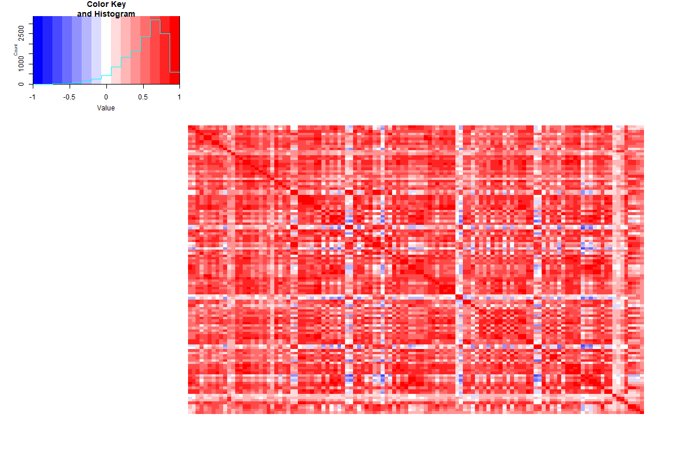
```

## K-Means Clustering
This project examined 3 alternate approaches to k-means clustering. The firt two are represented in the literature and the third represented a novel approach. It should be noted that all three approaches calculate distance in terms of $L_2$-norms, but the data is transformed into different domains to explore the informativeness of both local and global properties of the brain. All stimuli matrices

### Clustering on Raw Correlation Matrices
First clustering performance was assessed in the untouched correlation matrices. This is perhaps one of the most well represented techniques in dynamic connectivity. Although we had *a priori* reasons for suspecting certain numbers of cluster to emerge aligning with our main stimuli grouping (valence, own/other, and fixation). We chose a na&iuml;ve approach to cluster selection and examined the within-cluster (WC) distance of a range of cluster numbers in order to determine the optimal number via the elbow method. The WC distance was determined under 50 random restarts in order to protect again the effects of initial cluster assignment and the final cluster under 2,000 restarts.

```{r kmeans, eval=FALSE}
k.max = 15
wss <- sapply(1:k.max,function(k){kmeans(corr.array, k, nstart=50,iter.max = 30 )$tot.withinss})
  
plot(2:k.max, wss[2:15], type = "b", pch = 19)
```

%```{r wcDistance, echo=FALSE, out.width="400px", fig.align="center", fig.cap="Within-Cluster Distance of different amounts of %clusters"}
%
%```


There did not seem to be a well defined elbow (similar to the plot displayed for PCA) but beyond 4 clusters, there was seeming linear trend, so 4 was chosen by consenus. When examining the confusion matrix, it was clear that there was some limited success in accurately sorting connectivity matrics, but it largely preformed quite poorly.

### Clustering on Principle Components
Because connectivity matrices represent the information from 116 anatomical regions, it represent extremely high dimensional data. Dimensions that don't provide much meaningful variance may be impeding accurate classification. To test this hypothesis, we applied principle component analysis to each matrix and extracted the 3 largest principle components to perform clustering on. See the following figures for a summary of this process.

```{r wcDistance, echo=FALSE, out.width="200px", fig.align="center", fig.cap="Amount of variance explained by top principle components"}
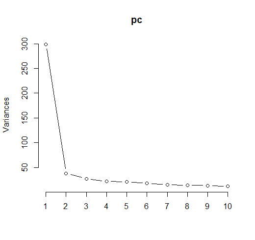
```

As this PC variance plot shows, the first component carries the largest amount of variance. This large weight on the first component may be driven by collinearity among regions which is to be expected to some degree. Still, some variance was captured in smaller components. For ease of visualization 3 components were chosen for clustering variables.

Again, just as in the untouched correlation matrices, there was no clear elbow to guide choice of numbers of clusters but it appeared that 4 would be a reasonable choice.

```{r PCelbow, echo=FALSE, out.width="200px", fig.align="center", fig.cap="Elbow plot of PC clustering"}
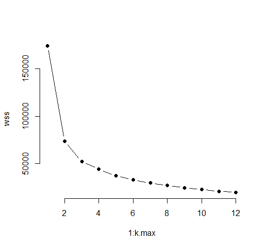
```
Thus we executed the following:
```{r pcaKmeanCode,  eval=FALSE}
#PCA and Kmean. Data should be the combined corr. matrix.
pc = prcomp(sapply(data[,-c(1:2)], as.numeric), center= TRUE)
```

Plots of the cluster assignment were dubious. Although they seemed to make clean divisions along the PC dimensions, there did not appear to be any natural grouping of the data to drive this results and it was suspected that large amounts of this may be spurious.
```{r PCclustering, echo=FALSE, out.width="200px", fig.align="center", fig.cap="Plots of Principle Component and Cluster Assignment"}
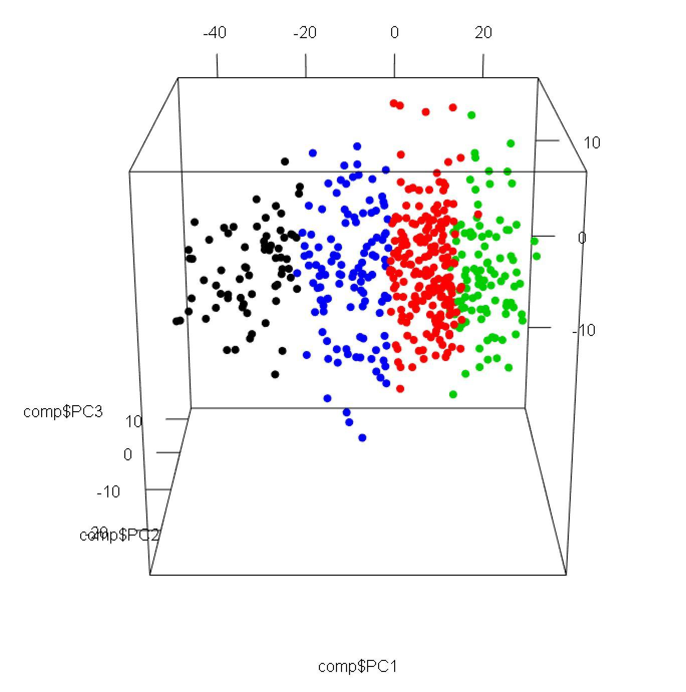
```

However, on closer inspection, there did appear to be some slight natural grouping of the data in terms of cluster assignment seemingly falling along rough heteroskedasctic levels along the first principle component. This was very interesting because it was suggestive of the thought that variability in connectivity might have an important role in distinguishing brain states.
```{r PCplots, echo=FALSE, out.width="200px", fig.align="center", fig.cap="Plots of Principle Component Values"}
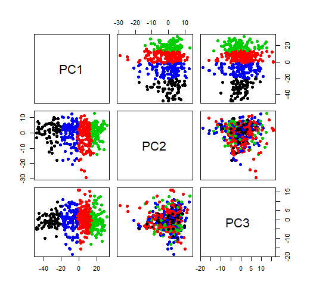
```

But the clean cut separation of connectivity states translated only marginally in terms of it's accuracy in representing mental states. There appeared to be a high amount representation of InfOtherNeg in cluster 1, cluster 2 had no clearcut grouping, cluster 3 perhaps had a slight over representation of passive viewing, and again cluster 4 had no clear groupings. This leaves room for much susicion in the inferences neuroscientists are currently drawing on these techniques.
```{r PCconfusion, echo=FALSE, out.width="200px", fig.align="center", fig.cap="Confusion Matrix PC Components"}
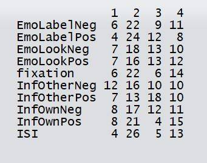
```


### Clustering on Graph Metrics
The preceeding clustering approaches relied on local differences in neural coordination. However, it is well known that the brain exhibits global properties that are important for cognition (@bertolero2015modular). Therefore we attempted to cluster matrices on two widely used graph metrics in neuroscience, rich club structure which provides a measure of the number of highly connected nodes and the mean path length which is related to communication efficiency. Graphs were constructed from thresholding of the correlation matrices setting all correlation coefficients less than $\rho = .85$ to 0. For visualization, network shown below have been thresholded at $\rho < .93$. Examples of the resultant graphs are provided.

```{r network1, echo=FALSE, out.width="200px", fig.align="center", fig.cap="Network generated for InfOwnNeg connectivity"}
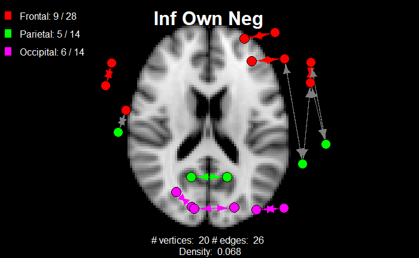
```

```{r network2, echo=FALSE, out.width="200px", fig.align="center", fig.cap="Network generated for EmoLookNeg connectivity"}
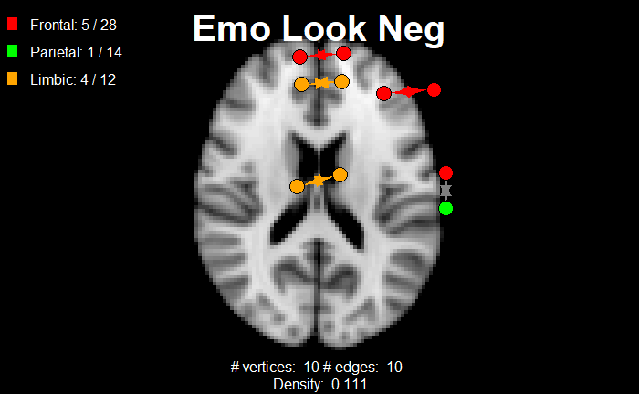
```

Rich club coefficients and mean path lengths were calculated as follows:
```{r richAndMean, eval=FALSE}
library(brainGraph)
library(igraph)
richclub_coef = numeric(432)
mean_dist = numeric(432)
for (i in 1:length(x)) {
  file = read.csv(x[i])
  cor_mat = as.matrix(file)
  data = cor_mat[,-1]
  rownames(data) = data[,1]
  for (j in 1:116) {
    for (k in 1:116) {
      if(colnames(data)[j] == fin$Name[k])
        colnames(data)[j] = fin$Code[k]
    }
  }
  rownames(data) = colnames(data)
  cor_g <- graph_from_adjacency_matrix(data, mode='directed',
                                       weighted = 'correlation')
  cor_edge_list <- igraph::as_data_frame(cor_g, 'edges')
  only_sig <- cor_edge_list[abs(cor_edge_list$correlation)>.85 &
                              abs(cor_edge_list$correlation)<1 , ]
  new_g <- graph_from_data_frame(only_sig, T)
  bg = make_brainGraph(new_g, atlas = "aal116")
  richclub_coef[i] = rich_club_coeff(bg)$phi  
  mean_dist[i] = mean_distance(bg)
}


results = data.frame("Data" = x, "Rich_Club_Coefficient" = richclub_coef,
                     "Avg_path_length" = mean_dist)

```

Within-cluster distances again indicated that 4 clusters may be an appropriate choice.
```{r graphWCdist, echo=FALSE, out.width="200px", fig.align="center", fig.cap="Within Cluster distances for graph poperties clustering"}
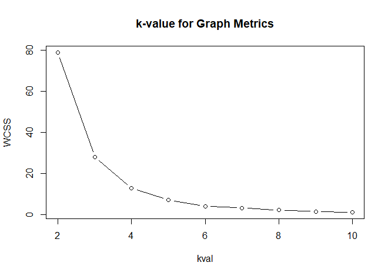
```


The graph metrics were treated as if they were $<x,y>$ coordinates and subjected to k-means clustering.

```{r graphConfusion, echo=FALSE, out.width="200px", fig.align="center", fig.cap="Confusion matrix for graph poperties clustering"}
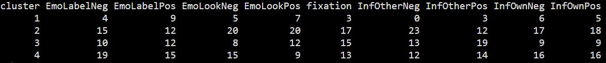
```
A more wholistic measure of the network also performed poorly, although there does seem to be some differential splitting among clusters 2 and 3 along valence lines. No other category seemed to provide such diffential splitting suggesting differences in emotional valence processing may show distinct patterns of connectivity which would be consistent with the broader literature of affective connectivity.

Although it was planned to make quantitative assessments of purity post-clustering, given the consistently poor clustering results across all approaches, this did not seem needed until more accurate approaches to brain network clustering are devised. Hence we deviate from our proposal to only provide qualitative assessment of clustering accuracy.

# Alternate Classification Approaches
Additionally we decided to cluster our correlation matrix using SVM and Random Forest to see if it would yield any acceptable performance.  Afterall, SVM and Random Forest seem to be heavily used algorithm to tackle classifications.  Our initial result was utter failure with 88\% Error rates when we used Random Forest with 100 trees and number of variables sampled at each split 5000. Initial results of SVM seemed little better than chance. We decided not to troubleshoot further due to lack of time and the computational demands of these approaches on such a large dataset.

Additionally we decided to cluster our correlation matrix using Random Forest to see if it would yield any acceptable performance.  Afterall, Random Forest seems to be heavily used to tackle classification problems.  Our initial result was an utter failure with when we used Random Forest with 100 trees and number of variables sampled at each split 5000.  The error rate of 88\% was calculated by the in-built algorithm.  We hypothesize that the failure to classify our correlation matrix into 10 categories is caused by lack of sufficient variance within individual correlation.  This suspicion seem warranted when we observe the graph of Within Sum Squared (WSS) values of K-Mean clustering, the decrease in WSS was empirically negligible for clusters considered beyond four clusters.  Therefore, it seemed reasonable to suspect the failure in attempts to cluster the correlation matrix into 10 groups would fail since additional clusters (after 4th) would not capture sufficient variance.  We decided not to troubleshoot further due to lack of time. 

## Random Forest
The results of random forest classification are as follows:
```{r randomForest, eval=FALSE}
data=read.csv("corr.matrix.combined.csv", header = TRUE)

head(data)
x_val=data[,-1]
y_val=data[,1]
library(randomForest)

model_rf=randomForest(x_val,y_val,mtry=5000, ntree = 100)
```

```{r RFresults, echo=FALSE, out.width="400px", fig.align="center", fig.cap="Results of Random Forest Clustering"}
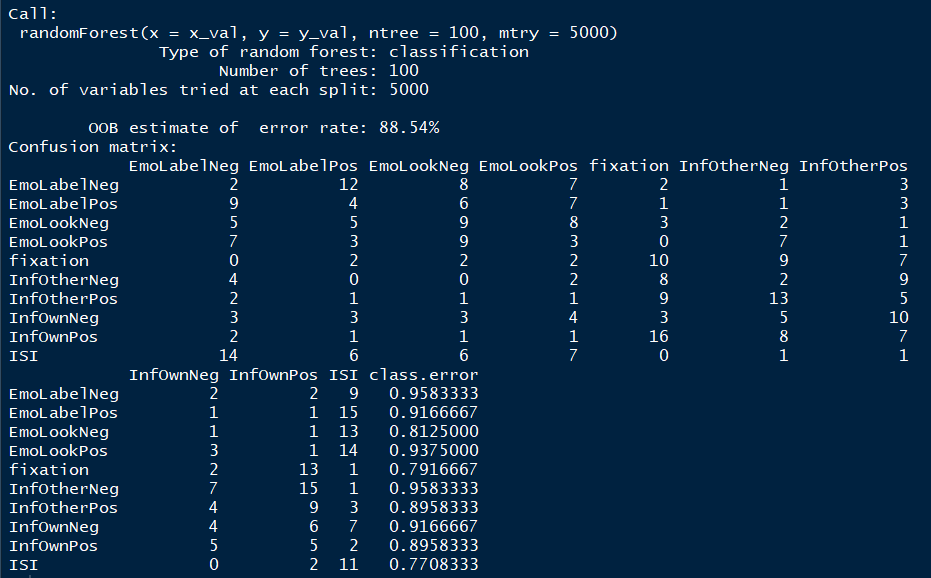
```
## Support Vector Machines
SVM was calculated in the following manner:
```{r svm, eval=FALSE}
library(caret)
ctrl = trainControl(method = "cv", savePred=T, classProb=T)
SVM_mod = train(y_val~as.matrix(x_val), method = "svmLinear", trControl = ctrl)
```

 
# Discussion
Although no method performed particularly well, there were some winners and losers. SVM and Random Forests should not be used to cluster imaging data as they performed by far the worst. PCA decomposition, although not stellar, provided slightly better results. Graph theoretic measures did not perform substantially better but it is entirely plausible that the particular graph meterics were not well suited and therefore we recommend that this area recieve more exploration to assess its importance.

There were servere limitations to this particular dataset that impede generalization more broadly. The subjects in this cohort had extremely high levels of head motion. This is a well known cause of noise in fMRI data (@van2012influence) and although efforts were made to screen for unacceptable levels of head motion, there still were elevated levels which may have impeded clustering. Although the imediate implication is that these analyses should be conducted in a cleaner dataset, it may also serve to highlight the role of noise in dynamic connectivity and serve as a reminder to the field to make all efforts to minimize other sources of noise such as heartbeat and respiration. Another limitation is our deviation from more standard dynamic connectivity pipelines in disrupting the temporal order of our stimuli matrices, but this was necessitated by the data and not a point that we believe detracts substantially from the interprettability of results.

Until the point however that more conclusive studies are conducted there should be a stong suspicion kept around drawing conclusions about cognition from the results of k-means or any other clustering technique. To our knowledge, this is the first study of its kind to take a systematic approach to testing the relationship between clustered transient brain connectivity and infered mental contents. On the basis of our work the assumption that such clusters respresent unitary cognitive states is untenable.

It is the hope of the authors of this class project that the presummed relationship between mind states and brain states is viewed with a weary eye.

# Appendix A.

## Philosophical Assumptions
It is imperative to establish the core philosophical understanding from which this data is being approached from. The core tenants to follow are neither radical nor unreasonable, but are too often left implicit in discussions of brain science. If however we accept these tenants to be true, then the analysis we present follows quite naturally.

### Assumption #1 -- Brain states represent cognitive states
This is the idea that when we discuss a particular configuration of correlation among brain regions, it reflects a particular internal representation experienced by the individual. Although the correctness of this assumption may be challenged in some extreme cases (*e.g.* persistent vegetative states), this is the driving ontological stance of neuroscience for typically functioning human beings. If we did not believe the brain was representative of the mind, there would be little point to studying its function. This is not to say that all brain function maps well onto mind function and in fact there is evidence that much of it may be attributable to basal metabolic functions (@raichle2007default). Yet despite this significant confound, it is assumed that as long as a human is functioning in a state that we would reasonably believe they possess a mind, the network configuration of their brain represents some element of the brain-to-mind mapping.

### Assumption #2 -- Different brain states represent different cognitive states (and same represents same)
Again this is an assumption that cuts to the core of neuroscience but an essential one to articulate. It perhaps can best be summarized by the statement that if we observe "Brain Connectivity A" at time 1 then (according to Assumption 1) we can ascribe to it the "Mental Contents A". If we then later observe "Brain Connectivity A" at time 2, then we can also ascribe "Mental Contents A" to the individual at this later time. The converse is also assumed true that if two brain states differ then so do their mental contents. This is not to say that there is absolutely no overlap in either brain states or cognitive states, but that if we can ascribe different mental states to individuals then we can naturally expect their brain connectivity to differ across these mental states. We cannot neglect some of the differences to be attributable to differences in the metabolic considerations mentioned above. But for the relatively homongenous environment of an fMRI scanner, this will be, rightly or wrongly, assumed negligible in comparison to cognition induced shifts.

### Assumption #3 -- Different environmental inputs induce different brain states
This is the idea that the brain must act adaptively to its environment such that if two environmental stimuli are sufficiently divergent on some salient property, then they will induce different configurations in the brain (and hence different mental contents by way of assumption 2). This assumption is left deliberately vague on what constitute different stimuli, but given the abundance of neuroimaging literature observing different activity patterns in brain states across different tasks, this is no stretch of the imagination.

# Referrences
