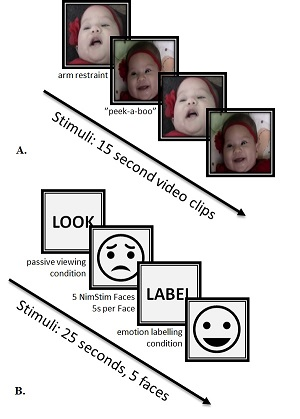

```{r setup, include=FALSE}
knitr::opts_chunk$set(echo = TRUE, fig.height = 4)
```
# Team Information
**Team Members:** M.K. Finnegan$^1$, K. Bharadwaj; DH Hwang; R Dalmia

&nbsp;&nbsp;&nbsp;&nbsp; 1. *Corresponding Author*

# Note to the Reader
*The code that generated these results can be found at [this github repository](https://github.com/heuristicwondering/STAT432-StatisticalLearning-FinalProject). The data is available upon request to the corresponding author at mkfinne2@illinios.edu*

# Abstract
Mind wandering (a type of task unconstrained thought) is an important phenomenon that is presumed to occur during resting state imaging paradigms. Little is known about the temporal dynamics of these thoughts during the resting state, however the dynamics of brain connectivity which presumably represent such thoughts are beginning to be explored with dynamic connectivity in fMRI. Current techniques for classifying similarities of brain connectivity in this approach have not been evaluated for the meaningfulness of their classifications. This proposed study uses inferred cognitive states as the "true classification" of a given brain state allowing for testing of classification accuracy. Under the principled presumption that classification accuracy during task paradigms can provide an estimate of accuracy during rest paradigms we use two emotional processing tasks to evaluate these methods. Cognitive states are inferred by the stimuli being presented during two different block design tasks and metrics of psychopathology such as depression and anxiety. Modern clustering algorithms are tested as to whether they provide clusters that accurately overlap stimuli presentation during two block design tasks subject to potential covariance with measures of psychopathology symptoms.

<!-- ------------------------------------------------------------------------------------------------------------- -->
<!-- ------------------------------------------------------------------------------------------------------------- -->
<!-- ------------------------------------------------------------------------------------------------------------- -->

# Introduction
There is a wealth of evidence that when humans aren't engaged in any externally oriented task, they are consistently immersed in a phenomenon called mind-wandering (@binder1999conceptual,@buckner2008brain,@christoff2016mind,@mason2007wandering,@smallwood2015science). This is a type of unconstrained thought that may facilitate creativity and problem solving (@fox2015wandering), but in more maladaptive forms, may be repsonsible for the recurrence and maintenance of both depressive and anxious disorders (@teasdale1983negative,@burdwood2016resting,@nolen1991responses,@nolen2000role).

*Dynamic connectivity* is comparitively recent development in functional neuroimaging analysis that shows immense promise towards understanding the role of mind-wandering in health and disease (@kucyi2014dynamic). For the interested reader, please refer to the original study proposal for a more comrehensive overview of the concepts involved in dynamic connectivity. Briefly, by calculating brain connectivity (*a.k.a* correlations of hemodynamic fluctuations across brain regions) on short time windows (on the order of seconds to minutes) rather than across an entire scan (which is typically on the order of 10 to 20 minutes), we can capture the temporal fluctuations of brain activity across a scan (@hutchison2013dynamic). These fluctations presumably reflect, in part, the fluctuations of the internal contents of thought.

A current common practice to label similar connectivity matrices produced by this approach is k-means clustering using either the L1 (Manhattan distance) or L2 (Euclidean distance) norms (@hutchison2013dynamic,@allen2014tracking). Typically, the k-means derived clusters are assumed to represent either unitary cognitive states or transitions between two unitary states. The differences of members across cluster are then either qualitatively or quantiatively analyzed (such as noting the degree of connectivity between executive and emotional systems) to make inferences about the nature of thought across time. In fact, this approach has been used to argue that short term meditation trainining decreases the mind's propensity to wander (@mooneyham2017states) and that people who are more likely to  be creative posess unique types mindwandering (@beaty2018brain).

K-means clustering however, will always produce clusters regardless of how well those clusters represent the underlying distribution of the data. Under certain distributions, k-means clusters have little if any relation to the regularities inherent in the data. The algorithm underlying k-means seeks to minimize the within-cluster distance objective function. For the case of the commonly used Euclidean distance:

\[
\sum_{i=0}^{n} \min_{\mu_j \in C}(\parallel x_i - \mu_j \parallel^2)
\]

This makes the implicit assumption that the true clusters are both convex and isotropic (*i.e.* their boundaries can be defined by circles drawn around them). This means the k-means will not perform well when the data is non-convex, has anisotropic covariance, has spatially overlapping memberships, or contains outliers which artificially skew cluster means. There is no known evidence that that brain connectivity as represented in ${\rm I\!R}^n$ meets any of these assumptions.

The purpose of this study is to examine the suitability of k-means in real data. In order to test the accuracy of the clustering results, two task-based paradigms are used in which the "true" classification of a brain state is assumed to be the stimuli presented at that time. See Appendix A (material originally introduced in the project proposal but for convenience to the reader, included here) for a detailed exposition of the philosophical assumptions justifying this approach. This allows us to test the derived classification against the "true" labels. Two tasks within the same subject cohort are employed as a means to assess the robustness of k-means clustering across paradigms while controling for subject demographics. Each task was repeated across two scans within each subject (for a total of 4 scans per subject), which is leveraged to ensure algorithms are not fitting technological sources of variance such as magnetic gradient nonlinearities or subject head position induced distortions (@jovicich2006reliability) which may vary across scans. As an extension of this work, alternate classification approaches are explored for potential improvements to current dynamic connectivity analisys practice.

Distribution of the raw data imaging data is restricted due to HIPPAA considerations, thus is not included in this report however all derived data, including timecourses used to produce the correlation matrices can be found in the link to the team's Box account submitted with this report.

## Description of Data Set
### Participants
The results reported here are based on a subset of women from a larger study examining the role of stress physiology in mother-infant interactions. They were primarily recruited from community agencies serving low-income women in a mid-size city of the Pacific Northwest. Twenty-five mothers with 3-month old infants agreed to participate in the additional neuroimaging reported here. Mean age for these mothers was $\mu = 26.4$ ($SD = 3.8$). Most identified as Caucasian (72\%), with 12\% reporting Latina ancestory, 8\% Asian American, and 8\% other. Eightyfour percent reported some education beyond high school, with 24\% having completed a college degree. No infants had serious health complications and the majority were born on time (4\% before 37 weeks and 8\% after 41 weeks gestation). This dataset is also described in @laurent2018mindfulness. Ethical approval for the study was obtained from University of Oregon Institutional Review Board and all mothers provided written informed consent.

### Scan Paradigm
Participant engaged in two separate tasks for this study, one involving infants expressing emotions and the other presenting emotionally expressive faces, however only the task observing infant emotional cues is reported here. The task was repeated across two scans. Scans were counter balanced across tasks to control for order effects and subjects were allowed to shift positions between scans in order to minimize discomfort related head movements. See Figure *** for an overview of both paradigms.

#### Infant Viewing Task
Mother's were instructed to "watch and respond as you would naturally" to videos of theirs or unknown others' infants expressing either positively or negatively valenced emotional cues. Emotional expressions in the infants were evoked during a video recording session occurring in a home setting. Positive valence expressions occurred during a peak-a-boo game played with the mother. Negative valence was induced by arm-restraint, a task known to evoke frustration response in infants (@moscardino2006infants). Each run lasted for approximately 7.5 minutes and consisted of alternating blocks of the infant emotion videos editted to be 15s in length.

#### Facial Viewing/Labelling Task
A second task involved a well studied paradigm of emotion regulation in which mothers viewed emotionally expressive faces from the NimStim database (@tottenham2002categorization). Face images were race matched to the participants to take advatage of heightened neural responsiveness to in-group faces (@chiao2008cultural). Three second instructions appeared prior to each stimulis block with the words "Look" or "Label", in which participants either were to passively view or label the emotional content of the faces. Blocks consisted of 5 faces of a given positive/negative valence (*e.g.* happy, sad, angry, etc.) each presented for 5 seconds each. Blocks were separated by 1-3s of jittered rest condition. Each scan lasted for approximately 7.6 minutes.

```{r pressure, echo=FALSE, fig.align="center", fig.cap="Schematic of the two tasks that produced the data. (A.) Mothers viewed either their own or others' infants displaying either positive (induced by playing peek-a-boo) or negative (induced by arm restraint) emotions. (B.) Mothers were instructed to either passively view or label the emotional content of humans faces."}

```
### Scan Acquisition
Scans were acquired at the University of Oregon using a Siemens Allegera 3 Tesla magnet. Whole brain images were taken with a 32-channel phase array birdcage coil. Shimming routines were conducted to optimize signal-to-noise with a subsequent fast localizer scan (FISP) and Siemens autoalign routine at the outset of every session. The two functional scans were then conducted followed by a high resolution anatomical scan.

#### Function Scans
All tasks used a T2*-weighted gradient echo sequence, with TR = 2000 ms, TE = 30 ms, flip angle = 90°, 32 contiguous slices acquired in ascending interleaved order, with thickness = 4 mm, 64 × 64 voxel matrix; 226-228 volumes per run.

#### Anatomical Scan
Anatomical images used a T1-weighted 3D MP-RAGE sequence, with TI = 1100 ms, TR = 2500 ms, TE = 3.41 ms, flip angle = 7°, 176 sagittal slices 1.0 mm thick, 256 × 176 matrix FOV = 256 mm.

<!-- ------------------------------------------------------------------------------------------------------------- -->
<!-- ------------------------------------------------------------------------------------------------------------- -->
<!-- ------------------------------------------------------------------------------------------------------------- -->

# Descriptive Exploration of Data
## Preprocessing
All preprocessing was carried out in the SPM12 software (@ashburner2014spm12) running under MATLAB 2018a on Windows 10 using a custom written batch interface. Because of the extensive time needed to run computations serially, all preprocessing routines were parallized across subjects. Preprocessing included slice-timing correction which is use to account for the fact that, due to the interleaved slice acquisition order, adjacent data points will represent activity up to 1 second apart in time. Data points are sync interpoloated either forward or backward in time to the reference slice, which was chosen to be the slice collected 1s into volume acquisition. Next, volumes within each scan underwent realingment and unwarping to correct for head motion artifacts across the scan.

Realignment consisted of a 2-pass procedure in which a mean image within a scan was calculated and volumes were put in alignment using a 6-parameter least squares approach to rigid body transformations. These estimated alignment parameters were then inspected to remove subjects with excessive head motion defined as more than 40\% of volumes containing greater than 2mm of estimated headmotion. This is a very liberal motion limit, however in clinical or hard-to-recruit samples, it is very common to relax more stringent limits and the particular value was taken on recommendation of the PI who supervised data collection. With this criteria, one subjected had to be discarded for excessive movement. Unwarping was also conducted to account for gradient field disortions that occur due to this movement. Although fieldmaps were acquired which provided an absolute measure of the degree of magnetic homogeneity throughout the field of view, they were not referenced during unwarping due to the fact that subjects moved substantially between scans making the field map not applicable to all runs. Instead deformations were estimate using SPM12 algorithms.

Functional images were then co-registered to the high resolution structural image for each subject. This involves similar computations to the realignment step, however alignment occurs across scans. The anatomical images were then used to calculate non-linear deformations to warp the brain into the Montreal Neurologic Institute (MNI) standard stereotaxic space in a process known as normalization. The detailed deformation fields were then applied to the low resolution functional images. This process allows for voxel-by-voxel comparisons across subjects and is necessary to apply the region-of-interest masks needed to extract data for k-means. Given that fMRI typically has a relatively poor signal-to-noise ratio, all functional images were smoothed with an 8mm FWHM Gaussian smoothing kernel in order to compensate for spurious fluctuations.

## Voxelwise Analysis
In order to confirm there was task correlated signal that could potentially drive clustering, a voxelwise level analysis was conducted to 

-- voxelwise analysis
-- linear regression

<!-- -->
3. Exploratory Data Analysis
4. Planned Analysis
 - Preprocessing --> Correlation
 - k-means
 - what else?
5. Discussion
6. Conclusion
<!-- -->


# Appendix A.

## Philosophical Assumptions
It is imperative to establish the core philosophical understanding from which this data is being approached from. The core tenants to follow are neither radical nor unreasonable, but are too often left implicit in discussions of brain science. If however we accept these tenants to be true, then the analysis we present follows quite naturally.

### Assumption #1 -- Brain states represent cognitive states
This is the idea that when we discuss a particular configuration of correlation among brain regions, it reflects a particular internal representation experienced by the individual. Although the correctness of this assumption may be challenged in some extreme cases (*e.g.* persistent vegetative states), this is the driving ontological stance of neuroscience for typically functioning human beings. If we did not believe the brain was representative of the mind, there would be little point to studying its function. This is not to say that all brain function maps well onto mind function and in fact there is evidence that much of it may be attributable to basal metabolic functions (@raichle2007default). Yet despite this significant confound, it is assumed that as long as a human is functioning in a state that we would reasonably believe they possess a mind, the network configuration of their brain represents some element of the brain-to-mind mapping.

### Assumption #2 -- Different brain states represent different cognitive states (and same represents same)
Again this is an assumption that cuts to the core of neuroscience but an essential one to articulate. It perhaps can best be summarized by the statement that if we observe "Brain Connectivity A" at time 1 then (according to Assumption 1) we can ascribe to it the "Mental Contents A". If we then later observe "Brain Connectivity A" at time 2, then we can also ascribe "Mental Contents A" to the individual at this later time. The converse is also assumed true that if two brain states differ then so do their mental contents. This is not to say that there is absolutely no overlap in either brain states or cognitive states, but that if we can ascribe different mental states to individuals then we can naturally expect their brain connectivity to differ across these mental states. We cannot neglect some of the differences to be attributable to differences in the metabolic considerations mentioned above. But for the relatively homongenous environment of an fMRI scanner, this will be, rightly or wrongly, assumed negligible in comparison to cognition induced shifts.

### Assumption #3 -- Different environmental inputs induce different brain states
This is the idea that the brain must act adaptively to its environment such that if two environmental stimuli are sufficiently divergent on some salient property, then they will induce different configurations in the brain (and hence different mental contents by way of assumption 2). This assumption is left deliberately vague on what constitute different stimuli, but given the abundance of neuroimaging literature observing different activity patterns in brain states across different tasks, this is no stretch of the imagination.

# Referrences
